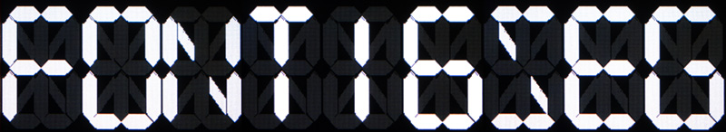

# font16seg

font16seg is a MicroPython module for M5Stack devices prividing a 16-segment font.

This is not a font file.
This module draws a letter as 16-segmented figures.



# Usage

You can download the font16seg archive package file from the [release page](https://github.com/zuku/font16seg/releases/latest).
The file can be found in the _Assets_ section. (file name format is `font16seg-vN.N.N.zip`)

Unarchive the file, you will find two types of files in it.

* `font16seg.mpy`
    * `.mpy` is a precompiled binary container file format.
    * This file is smaller, faster and more efficient than `font16seg.py`. However, it is not editable and has version restrictions.
    * See [MicroPython .mpy files](https://docs.micropython.org/en/latest/reference/mpyfiles.html)
* `font16seg.py`
    * MicroPython source code file.

Copy `font16seg.mpy` (or `font16seg.py`) to the directory listed in `sys.path`.

Then run the following code on your M5Stack device.

```python
import font16seg

font16seg.text(10, 10, "FONT16SEG")
```

# Supported versions

* M5Stack UIFlow (Micropython-1.12) official firmware.

Currently, this module has been tested on M5StickC Plus (UIFlow_StickC_Plus v1.11.5) only.
It may work on other models and versions.

# Defined letters

* Digits
    * `0123456789`
* A-Z (Upper case)
    * `ABCDEFGHIJKLMNOPQRSTUVWXYZ`
* Signs
    * `%*+-/<>[\]_`
* Colon
    * `:;` (`;` is used as unlit for colon)
* Point (Full stop)
    * `.,` (`,` is used as unlit for point)

You can assign the 16-segment definition to any letters. See [assign](#assigncode-flags) function.

# Functions

## assign(code, flags)

Assign the 16-segment definition to the specific character code.

* `code`
    * `int`
    * Character code to assign the definition.
    * Generally, 20 to 126 is used.
* `flags`
    * `int`
    *  16-bit flags indicate which segments are to be lit or not.

### Flags


### Example
If you want to assign the degree sign to 'd' (0x64).
Here is an example.

```python
font16seg.assign(ord('d'), 0b0100101010000000)
font16seg.text(10, 10, '4dC')
```


## attrib16seg(length, width, color, [unlit_color, letter_spacing, rotate])

Set attributes of the 16-segment font.
This function is similar to `lcd.attrib7seg()`. But the parameters are incompatible with that.

* `length`
    * `int`
    * Default: `4`
    * Length of the short segment rectangle part.
* `width`
    * `int`
    * Default: `2`
    * Width of the segment.
* `color`
    * `int`
    * Default: `lcd.get_fg()`
    * Segment color.
* `unlit_color`
    * `int`
    * optional
    * Default: `None`
    * Unlit segment color.
* `letter_spacing`
    * `int`
    * optional
    * Default: `3`
    * The distance between letters.
* `rotate`
    * `int`
    * optional
    * Default: `0`
    * Text rotation angle.
    * 0, 90, 180 or 270 is acceptable.

### Example

```python
font16seg.attrib16seg(8, 6, lcd.YELLOW, unlit_color=lcd.NAVY, letter_spacing=16)
font16seg.text(10, 10, 'FONT')
```


## fontSize()

Return calculated width and height of the font from the attributes.

## resetAttributes()

Restore the attributes to default. It is same as the following code.

```python
font16seg.attrib16seg(4, 2, lcd.get_fg(), unlit_color=None, letter_spacing=3, rotate=0)
```

## text(x, y, txt, [color, unlit_color])

## textWidth(txt)


# Develop

## Tests
```
$ pipenv run test
```

## Build
```
$ pipenv run build
```

## Package
```
$ pipenv run package
```

# License

This module is released under the MIT license.
